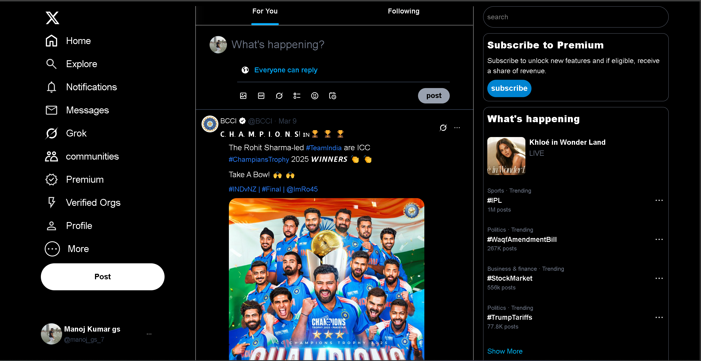

# 🐦 x-twitter

A responsive clone of Twitter's homepage UI built with Tailwind CSS.

---

## 📸 Screenshots

### 💻 Desktop View  

### 📱 Mobile View  

---

## 🛠️ Tech Stack

- Tailwind CSS
- HTML

---

## 🚀 How to Run

1. Clone the repository  
2. Open `index.html` in your browser  
No build tools or setup needed.

---

## 📁 Folder Structure (partial)

---

## 📝 License

This project is for **educational and demonstration purposes only**.  
All trademarks, logos, and brand assets used are property of their respective owners.  
No commercial use is intended.
